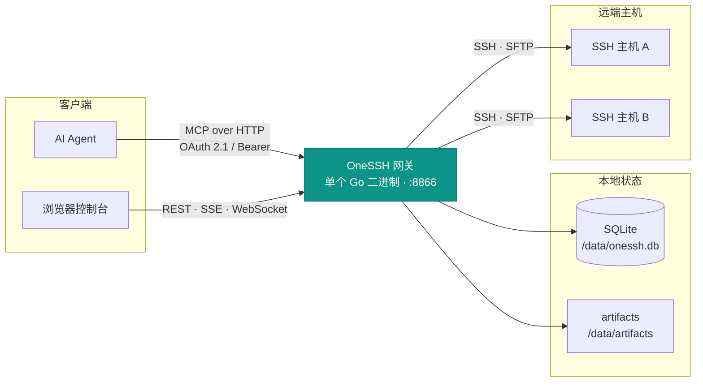

<div align="center">


# OneSSH

**面向 AI Agent 的集中式 SSH 网关**

一个 Go 二进制，同时提供 Streamable HTTP MCP、OAuth 2.1 授权、管理 API、实时活动流和浏览器终端。

[](https://github.com/Lynricsy/OneSSH/actions/workflows/ci.yml) [](go.mod) [](#mcp-接入) [](https://github.com/Lynricsy/OneSSH/pkgs/container/onessh)

</div>

---

## 为什么需要它

让 Agent 直接持有 SSH 私钥，安全性并非无解——`authorized_keys` 的 `command=`、`from=`、`restrict`、`permitopen=`，以及 CA 证书的有效期和 principals，都能实打实地收窄一把钥匙。真正的问题是这些控制点**分散在每一台主机上**：调整一次授权要遍历所有机器，撤销同理；而 sshd 的日志只到会话粒度，看不出 Agent 究竟读写了哪些文件。OneSSH 把这些控制点收敛到网关一侧：

- **凭据不出网关。** 私钥和密码以 AES-256-GCM 信封加密存放，只在拨号瞬间解密，Agent 永远拿不到明文。
- **权限可收敛。** 每个令牌绑定一组主机；执行权限与主机配置管理权限彼此独立，默认关闭后者。
- **随时可撤销。** 令牌是网关侧的一行记录，删掉即失效，不需要登录每台机器轮换 `authorized_keys`。
- **全程留痕。** 每次调用、每次权限拒绝都写审计；文件正文和编辑内容只记长度摘要，不落盘敏感数据。

对 Agent 侧则是一个标准 MCP 服务：`exec`、`file_read`、`file_edit`、`grep`、`find` 等工具开箱即用，语义与本地编码工具一一对应。

## 快速开始

```sh
export ONESSH_MASTER_KEY="$(openssl rand -hex 32)"
export ONESSH_ADMIN_PASSWORD='replace-with-a-strong-password'

docker compose up -d --build
curl --fail http://localhost:8866/healthz
```

打开 <http://localhost:8866/>，然后：

1. 用 `ONESSH_ADMIN_PASSWORD` 登录控制台。
2. 在**密钥**页生成 ed25519 密钥或导入 OpenSSH 私钥；也可以直接用主机密码。
3. 在**主机**页添加目标并点击「测试」，首次连接会记录 TOFU 指纹。
4. 在**令牌**页创建 Agent 令牌并选择执行范围；或者让支持 MCP OAuth 的客户端直接连 `/mcp`，在授权页勾选同样的主机与权限。
5. 手工令牌的明文只显示一次，立刻复制进 Agent 的安全配置。

> [!WARNING]
> 主密钥丢失后，已加密的 SSH 密钥和密码**无法恢复**。生产环境必须持久化保存 `ONESSH_MASTER_KEY`，不要每次启动重新生成。

停服不会删数据；只有确实要清空数据库和密钥时才带 `-v`：

```sh
docker compose down      # 保留数据卷
docker compose down -v   # 连数据一起删除
```

## 架构



后端只用 Go 标准库的 HTTP 路由，配合 `modelcontextprotocol/go-sdk`、`x/crypto/ssh`、`pkg/sftp` 和 CGO-free 的纯 Go SQLite。前端是 React 18 + React Router 7 + TanStack Query + Tailwind CSS v4，在 Radix UI 之上自建组件体系（浅色 / 深色 / 跟随系统三档主题），终端用 Ghostty Web 的 WASM + Canvas 实现，图表用 Recharts，最后由 `go:embed` 整体打进二进制——部署物就是一个文件。

## 能力总览

| 领域 | 能力 |
|---|---|
| **连接** | SSH 主机与 OpenSSH 密钥管理，密码与密钥两种认证；连接复用与 keepalive |
| **凭据** | AES-256-GCM 信封加密，私钥和密码仅在拨号时解密 |
| **信任** | TOFU 主机指纹，指纹变更直接拒绝连接，重装后需在 WebUI 显式重置 |
| **授权** | MCP OAuth 2.1 授权码流程：S256 PKCE、动态客户端注册、刷新令牌轮换、授权时选择主机范围 |
| **执行** | 持久 cwd/env 的命令会话、超时控制、并发批量执行、大输出转 artifact |
| **任务** | 后台任务的启动、状态、日志与终止，远端不留常驻组件 |
| **文件** | SFTP 读取、原子写入、`expected_sha256` 乐观锁编辑、目录浏览、跨主机传输 |
| **搜索** | `grep` / `find` 优先调用远端 ripgrep / fd，遵循项目忽略规则，缺失时自动降级 |
| **多媒体** | PNG、JPEG、GIF 首帧、WebP 的查看与缩放 |
| **监控** | Linux CPU、内存、负载、磁盘指标采集，保留 7 天 |
| **控制台** | React 管理界面、SSE 实时活动流、Ghostty Web 浏览器终端 |
| **审计** | 结构化审计记录；文件正文与编辑内容只留长度摘要 |

## MCP 接入

端点固定为 `/mcp`：

```text
http://localhost:8866/mcp
```

### 两种凭据

<table>
<tr><th>OAuth 2.1<br/><sub>推荐</sub></th><th>手工令牌<br/><sub>兼容</sub></th></tr>
<tr valign="top">
<td>

客户端通过资源元数据自动发现内置授权服务器，用 S256 PKCE 走授权码流程。管理员登录后在授权页选择全部主机、指定主机以及是否给出主机管理权限。

访问令牌 1 小时有效，刷新令牌 30 天有效且**每次使用都会轮换**。

</td>
<td>

给不能执行 OAuth 流程的客户端使用。在**令牌**页创建后，所有请求携带：

```http
Authorization: Bearer osh_...
```

</td>
</tr>
</table>

### 客户端配置

```json
{
  "mcpServers": {
    "onessh": {
      "type": "streamable-http",
      "url": "http://localhost:8866/mcp",
      "headers": {
        "Authorization": "Bearer osh_REPLACE_ME"
      }
    }
  }
}
```

具体字段名取决于 MCP 客户端。若客户端没有独立的 `headers` 配置，需要通过它的 HTTP transport 注入 `Authorization`。

<details>
<summary><b>OAuth 端点与生产部署要求</b></summary>

客户端会自动发现以下端点：

```text
/.well-known/oauth-protected-resource/mcp
/.well-known/oauth-authorization-server
/oauth/register
/oauth/authorize
/oauth/token
```

生产环境必须通过 HTTPS 暴露这些端点，并把 `ONESSH_PUBLIC_URL` 设为浏览器和 MCP 客户端实际访问的来源地址。只有 `localhost` 或回环地址的回调 URI 允许使用 HTTP。

</details>

### 工具清单

| 类别 | 工具 |
|---|---|
| 主机与执行 | `hosts_list` · `exec` · `session_env` · `exec_many` · `output_read` |
| 主机管理 | `hosts_manage_list` · `host_create` · `host_update` · `host_test` · `host_reset_fingerprint` · `host_delete` |
| 后台任务 | `job_start` · `job_list` · `job_status` · `job_logs` · `job_kill` |
| 文件 | `file_read` · `file_write` · `file_edit` · `file_list` · `file_transfer` |
| 搜索 | `grep` · `find` |
| 资源 | `image_view` · `host_status` |

常用编码工具是完整对齐的：`file_read`、`file_write`、`file_edit`、`exec`、`grep`、`find`、`file_list` 分别对应 read、write、edit、bash、grep、find、ls。

`file_edit` 支持 `expected_sha256` 乐观锁，冲突时应重新读取。大输出会返回 `artifact_id`，再用 `output_read` 分段读取或正则过滤。

<details>
<summary><b>搜索的原生路径与 SFTP 降级</b></summary>

`grep` 和 `find` 优先在目标主机上运行 `rg` 与 `fd`（Debian 的 `fdfind` 也识别），保留原生性能。命令不可用时自动切换到 SFTP + Go 实现——**OneSSH 不会为此修改远端主机**，不要求预装任何二进制。

降级路径同样遵循项目内的忽略文件，跳过二进制、大文件和符号链接，并保留 30 秒超时、256 KiB 输出上限和 100,000 项遍历上限。

结构化结果里的 `engine` 字段标明实际路径：原生为 `rg` / `fd`，降级为 `sftp`。只有降级时才返回 `warning`，提示大目录上的性能可能低于原生工具。

</details>

### 权限模型

令牌的 `all_hosts` / `host_ids` 只约束命令、文件、任务这类**远程执行**工具能访问哪些主机。

`manage_hosts` 是一项独立的全局配置管理权限，默认关闭。开启后可以维护全部 SSH 目标，但**既不扩大执行范围，也不会把新建的目标自动加进该令牌的授权列表**。主机密码经管理工具只写不读；所有管理调用和权限拒绝都会写入审计，密码参数固定脱敏。

## 配置

| 变量 | 必填 | 默认值 | 说明 |
|---|:---:|---|---|
| `ONESSH_MASTER_KEY` | ✅ | — | 64 位十六进制字符串，即 32 字节主密钥 |
| `ONESSH_ADMIN_PASSWORD` | ✅ | — | WebUI 管理员密码 |
| `ONESSH_LISTEN` | | `:8866` | HTTP 监听地址 |
| `ONESSH_PUBLIC_URL` | | 按请求推导 | 对外访问来源，如 `https://ssh.example.com`；生产 OAuth 部署应显式设置 |
| `ONESSH_DATA_DIR` | | `/data` | SQLite 与 artifact 数据目录 |
| `ONESSH_POLL_INTERVAL` | | `60` | 监控轮询秒数，设为 `0` 关闭 |

生成主密钥：

```sh
openssl rand -hex 32
```

## 本地开发

需要 Go 1.26+ 与 Node.js 22+。

```sh
cd web && npm install && npm run build && cd ..
CGO_ENABLED=0 go build -o onessh ./cmd/onessh
```

```sh
export ONESSH_MASTER_KEY="$(openssl rand -hex 32)"
export ONESSH_ADMIN_PASSWORD='replace-with-a-strong-password'
export ONESSH_DATA_DIR="$PWD/data"
./onessh
```

前端热更新用 `cd web && npm run dev`，Vite 会把 `/api` 与 `/mcp` 代理到 `:8866`。

## 测试

单元测试与前端生产构建：

```sh
go test -count=1 ./...
(cd web && npm run build)
```

<details>
<summary><b>三主机端到端测试</b></summary>

完整 E2E 会拉起 OneSSH、两个带 `rg` / `fd` 的 OpenSSH 容器，以及一个刻意不装搜索二进制的容器来覆盖降级路径。测试固定使用管理员密码 `test123`，并通过管理 API 创建 `ssh1`、`ssh2`、`ssh-no-tools` 和测试令牌：

```sh
export ONESSH_MASTER_KEY="$(openssl rand -hex 32)"
export ONESSH_ADMIN_PASSWORD='test123'
docker compose -f docker-compose.yml -f docker-compose.test.yml down -v
docker compose -f docker-compose.yml -f docker-compose.test.yml up -d --build
ONESSH_URL=http://localhost:8866/mcp \
  go test -count=1 -tags e2e -run TestEndToEnd -v ./e2e
```

覆盖范围：持久 cwd、大输出 artifact、后台任务、结构化文件编辑、跨主机传输、原生与 SFTP 降级搜索、图片、主机授权、现场监控、审计脱敏和 WebSocket 终端。

</details>

## 持续集成与镜像

`.github/workflows/ci.yml` 在 push、指向 `main` 的 PR 以及手动触发时运行三组检查：

- **backend** — `gofmt`、`go mod tidy` 差异、`go vet`、单元测试、CGO-free 构建
- **frontend** — 锁定依赖安装、TypeScript 检查、生产构建
- **e2e** — Docker Compose 三主机端到端（含无 `rg` / `fd` 的降级路径）

只有 `main` 分支或 `v*` 标签的 push 在全部检查通过后才发布镜像。工作流使用仓库自带的 `GITHUB_TOKEN` 写入 GHCR 并生成来源证明，不需要额外配置 PAT。

```sh
docker pull ghcr.io/lynricsy/onessh:latest
```

同时会打出分支、Git 标签和 `sha-<commit>` 三类标签。

> [!NOTE]
> GHCR 首次发布的包默认私有。需要匿名拉取的话，要在 GitHub Packages 设置里显式改为公开。

## 数据与安全

**存储布局**

- `/data/onessh.db` — 主机、加密凭据、令牌哈希、任务、审计与指标。
- `/data/artifacts/` — 被截断的命令输出；启动时以及每小时清理超过 7 天的文件，指标数据同样保留 7 天。
- 升级既有数据目录会自动执行 OAuth 表与令牌字段迁移；迁移失败时不会跳过，也不会部分登记版本号。

**凭据与令牌**

- 手工令牌、OAuth 访问令牌、授权码、刷新令牌一律只以 SHA-256 哈希入库，明文不落盘。
- OAuth 访问令牌绑定到授权请求中的 `/mcp` 资源，换到其他资源不可复用；授权码 5 分钟过期且只能用一次。
- 刷新令牌属于稳定的授权族：轮换后的旧值一旦被重放，该族现存的访问令牌与刷新令牌会被全部撤销。

**Web 会话**

- WebUI 使用 24 小时 HMAC Cookie，OAuth 同意页复用同一个管理员会话。
- 授权页与登录页返回 `frame-ancestors 'none'` 与 `X-Frame-Options: DENY`，阻断第三方页面嵌入发起的点击劫持。
- 生产环境必须通过 HTTPS 反向代理访问。

**运维约束**

- 首次连接会接受并保存主机指纹；指纹变化即拒绝连接，确认主机确实重装后才能在 WebUI 重置。
- 令牌与 OAuth 授权都按最小权限分配主机，不再使用立即删除。
- 不要把 `ONESSH_MASTER_KEY`、管理员密码、Agent 令牌、OAuth 令牌或导出的数据卷提交到版本控制。
